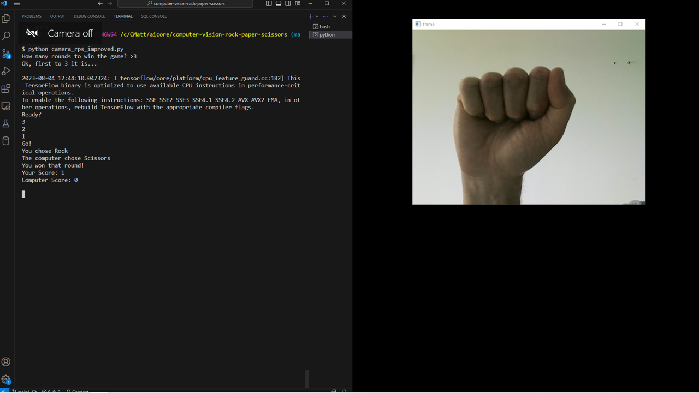
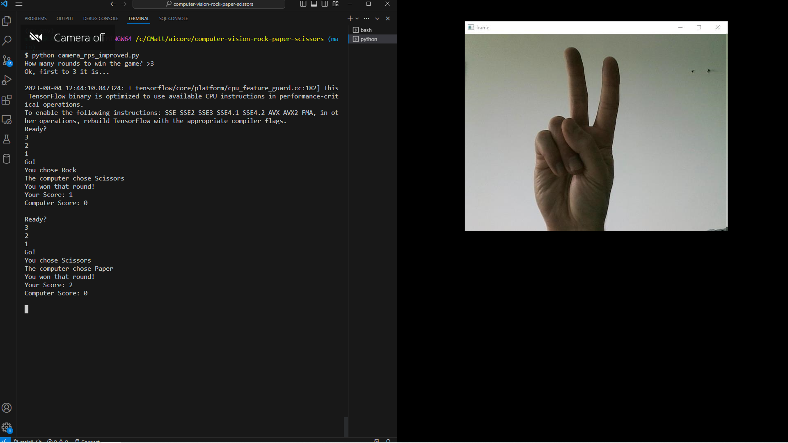
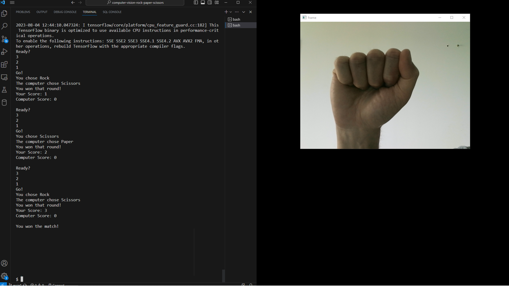

# Computer Vision RPS

# 
> This project aims to use a [Teachable Machine model](https://teachablemachine.withgoogle.com/) and Python to create a video-based game of ['Rock, Paper, Scissors'](https://en.wikipedia.org/wiki/Rock_paper_scissors). 

## Milestone 1
A GitHub Repo was created and cloned to the local machine.

## Milestone 2
An image-based model was trained using the [Teachable Machine website](https://teachablemachine.withgoogle.com/).

- Image data was captured for Four classes: *Rock*, *Paper*, *Scissors* and *Nothing* (a blank image). At least 200 images were captured for each class.
- The Teachable Machine model was then trained on the four classes, using the default settings.
- Prior to downloading the output files, the performance of the model was tested.  This involved recapturing images for one of the classes, which was not well-recognised.
- The files were downloaded using the default settings from the `Tensor` tab.

After downloading the files, the `keras_model.h5` and `labels.txt` files were staged, committed and pushed to the remote repository.

## Milestone 3

A virtual environment with the necessary dependencies was set up on the local machine.  

This included:
- `opencv-python`, a Python library for image processing and computer vision tasks 
- `tensorflow`, a deep-learning library for Python 
- `ipykernel`, to allow template Jupyter notebooks to be run within the environment

Template Jupyter notebooks with basic code were run to check the downloaded model worked as expected.

The output of the computer vision model is a (1, 4) Numpy array, which assigns a probability (0 to 1) to each of the Four possible Classes (*Rock*, *Paper*, *Scissors* and *Nothing*, respectively)  

 ## Milestone 4
A Python script was written to simulate a Rock-Paper-Scissors game between the **Computer** and the **User**. 
This involves 4 steps:
    - Randomly selecting the **Computer's** choice, using the `random.choice` method in Python.
    - Asking the **User** to select their choice (*R*, *P* or *S*), with error checks to ensure the entry is valid.
    - Determining the result of the game, from the perspective of the **User**
    - Printing the result to the terminal

After confirming the game functioned correctly, code was tidied to ensure it conforms to the PEP 8 Style Guide in `play.py`.

## Milestone 5

The above elements (the computer vision model and the basic game structure, written in Python) were combined to make the final game.  This was done in several sub-stages:

1. A function (`get_prediction()`) was created to convert the image-based prediction made by the computer vision model into the user's guess for the game.  The array returned by the model was obtained. The class assigned the highest probability by the computer vision model was identified from the array. The index of the class with the highest probability was matched to a dictionary of text labels to return the name of the class as the output from the function (i.e. *Rock*, *Paper*, *Scissors* or *Nothing*) as the **User's** choice (replacing the text-based entry of this from the earlier version).

2. A countdown was created prior to capture of the image used for prediction by the computer vision model.  This was implemented by tracking the elapsed time within the image capture loop, over a ten second period. At time zero, the image window opens.  After five seconds, the user is prompted to get ready. There is then a countdown from three to zero before the image is captured.  The **User's** choice, based on the computer vision model is printed in the terminal.

3. The logic of the game in Python was extended to allow multiple *rounds* of Rock-Paper-Scissors within a three-round *match*.  This was implemented by renaming the `play()` function defined under Milestone 4 to `play_round()`, and then defining a function `play_full_game()` which repeatedly calls `play_round()` until either the **User** or **Computer** has three wins.  The game up to this point is included in `camera_rps.py`

4. The game was further extended in two ways:
    - When the match begins, the user is asked how many rounds are needed to win. A reply incorporating the **User's** entry is printed before the match begins, and the number of rounds needed to win the match (i.e. the conditions of the `play_full_game()` loop) are altered accordingly.
    - At the end of the game, the a parting shot from the computer is randomly selected from a list and printed to the terminal. 

5. Screenshots from the game and the terminal are shown below. 

 

 

 

6. Further improvements, with more time, would be to allow the user to play against a choice of characters, with interaction chosen specific to that character.  Another possibility (with quite a bit more time!) would be to include different difficulty levels, by making the computer prediction after the image prediction of the user's guess has been captured.  The probability of the computer's choice being one of the options that leads to a user win could be increased for an 'Easy' game, and reduced for a 'Difficult' game (leaving unweighted probabilities as standard). This could be implemented using the `weights` argument of the `random.choice()` provided by the random module.  The ethics of a computer guess being selected after a user guess (even if at random) seem slightly iffy to me, but you'll see far worse tactics if you play a few humans!

